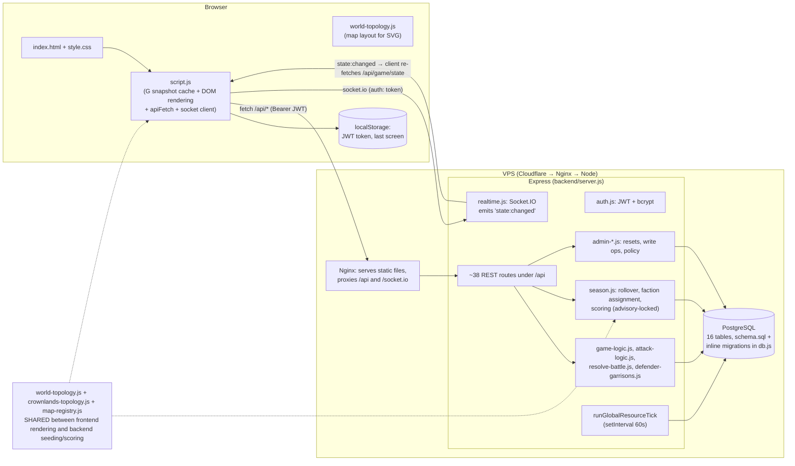

# 00 — Overview: SaiWars ("trying-game")

> Audience: AI agents executing the frontend/backend split. Read [`INTENT.md`](INTENT.md) first,
> then this file, then `01-CURRENT-STATE-ANALYSIS.md` before touching any code. All file paths are
> relative to the repository root. Hub: [`docs/README.md`](README.md).

## What the game is

**SaiWars** is a browser-based, shared-world, multiplayer **faction territory-conquest game**.

- Three factions — **blue, red, green** — fight over a graph of territories rendered as an SVG hex map.
- The game runs in **seasons**: 7-day campaigns separated by a 24-hour pre-season registration
  window (`season.*` in `config/balance.json`). Players must explicitly **join** each season; on join
  they are auto-assigned to the smallest faction. Players never choose a faction.
- Each player has a private **city**: 4 buildings (farm, lumbermill, ironmine, barracks) producing
  4 resources (food, wood, iron, manpower) every minute, plus a **soldier reserve** trained from
  resources.
- On the shared **world map**, players attack adjacent hexes, reinforce their faction's land, and
  recall stationed troops. Neutral captures are instant (**more attackers win**). Faction hexes use
  a hidden rally then live rounds (`battle-rules.js`).
- Owned territories give faction-wide bonuses (production %, training discount, storage cap %,
  passive fortress troop generation) and score points. At season end the faction with the highest
  territory score wins; winners' accounts get `season_wins + 1`, then the whole world resets and the
  map rotates (`three-frontiers` ⇄ `crownlands-64` via `map-registry.js`).
- Social/meta features: per-faction **chat** (season-scoped), a battle **activity feed**, per-season
  **player stats + rankings**, **season history**, and a **Sai-only admin panel** (world resets,
  player/territory editing, force-finish season).

## Feature specs

[`INTENT.md`](INTENT.md) is locked product intent. Feature pages (tune via [`config/balance.json`](../config/balance.json)):

[Shell](features/shell.md) · [Auth](features/auth.md) · [Seasons](features/seasons.md) · [City & economy](features/economy.md) · [Map](features/map.md) · [Combat](features/combat.md) · [Activity](features/activity.md) · [Chat](features/chat.md) · [Admin](features/admin.md) · [Realtime](features/realtime.md) · [Out of scope](features/out-of-scope.md)

## Current architecture (as-is)

Two runtime pieces, one repository:

1. **Frontend** — static vanilla HTML/CSS/JS (`index.html`, `style.css`, `script.js`,
   `world-topology.js`). No framework, no build step (only a `__BUILD_VERSION__` cache-buster
   substituted by the deploy script). Served by **Nginx** in production — the Express server does
   **not** serve static files.
2. **Backend** — Node.js **Express** monolith (`backend/server.js`, ~1,340 lines) + helper modules,
   backed by **PostgreSQL** (`pg` pool), **JWT auth** (`jsonwebtoken` + `bcrypt`), and **Socket.IO**
   for a single realtime "something changed, re-fetch" signal.

The backend is **already fully authoritative**: the client only renders server snapshots and submits
actions. There is no client-side game simulation. This makes the planned split primarily a
**port/re-platform** (Express→NestJS, self-hosted Postgres→Supabase, static JS→Next.js), not a logic
extraction.

### Realtime model (important)

`backend/realtime.js` attaches Socket.IO with JWT handshake auth. The server never pushes game data;
after any successful state-mutating request (middleware in `backend/server.js` lines 94–105) or a
resource tick, it broadcasts `state:changed` `{revision}` to **all** clients. Each client then
debounce-refetches `GET /api/game/state` (`scheduleRealtimeRefresh` in `script.js`). Polling backs
this up: full state every 60 s, chat every 4 s while the chat screen is open, activity every 30 s.

## File inventory

### Root (frontend + shared)

| File | Size | Role |
|---|---|---|
| `index.html` | 18 KB | The entire UI: auth screen, season gate, 5 screens (City, Map, Activity, Admin, Chat), bottom nav. Heavy use of inline `onclick="fn()"` handlers pointing at globals in `script.js`. Loads `/socket.io/socket.io.js`, `world-topology.js`, `script.js`. |
| `script.js` | 84 KB / 2,203 lines | All client code: auth flow, `G` state snapshot, `apiFetch` wrapper, SVG map rendering + pan/zoom, all screen renderers, chat, admin panel UI, Socket.IO client. Exports functions via `module.exports` for Node tests. |
| `style.css` | 32 KB | All styling; dark theme, faction theming via `[data-faction]`, mobile-first with bottom nav. |
| `world-topology.js` | 11 KB | **Canonical "Three Frontiers" map** (33 territories): territory defs, undirected edges, SVG layout coordinates, rotation-symmetry map. UMD module used by browser AND backend AND tests. `TOPOLOGY_VERSION = 2`. |
| `crownlands-topology.js` | 7 KB | Second map "Crownlands 64" (64 territories), same UMD shape. |
| `map-registry.js` | 1 KB | Registry of the two maps + season rotation (`getNextMapKey`). UMD, used by backend only in practice. |
| `package.json` | — | Single package for everything. Scripts: `start`, `dev`, `db:init`, `test` (node --test), `build` (syntax checks only). Deps: express, pg, bcrypt, jsonwebtoken, socket.io, helmet, express-rate-limit, dotenv. |
| `README.md` | — | Setup, admin bootstrap procedure, production JWT requirement. Links to `docs/`. |
| `config/balance.json` | — | **All gameplay tunables** (economy, combat, season, chat, auth limits). Loaded by backend via `config/balance.js`. Feature pages name the keys they use. |
| `.gitignore` | — | node_modules, .env*, logs. |

### `backend/`

| File | Role |
|---|---|
| `server.js` (51 KB, 1,341 lines) | Express app: middleware (helmet, rate-limit, trust-proxy, state-change notifier), all ~38 routes, snapshot builders (`getPlayerWorldState`, `getTerritoriesSnapshot`, `buildSeasonSummary`), offline resource catch-up, 60 s global resource tick. |
| `db.js` (21 KB) | pg Pool, `connect()` (pool) vs `getClient()` (dedicated conn for transactions), `schema.sql` loader, **inline idempotent migrations** (`applySchemaMigrations`), topology migration, world seeding, CLI (`--init`, `--bootstrap-admin`). |
| `schema.sql` | Base DDL: 16 tables (see `01-CURRENT-STATE-ANALYSIS.md` §4). Note: `season_memberships` exists only in `db.js` migrations, not in `schema.sql`. |
| `auth.js` | bcrypt(12) password hashing, JWT issue/verify, 24 h TTL, production secret enforcement. |
| `game-logic.js` | Pure functions loaded from `config/balance.json`: building defs/costs, production math, faction territory bonuses, storage caps, training cost, battle outcome. **The core rules module.** |
| `attack-logic.js` | `performAttack`: full transactional attack (advisory lock per territory, adjacency check, casualty allocation, capture, +25/25/25 loot, battle_history insert, stats). |
| `resolve-battle.js` | Legacy coordinated-attack resolution reading `attack_contributions` (no writer remains → effectively dead). |
| `defender-garrisons.js` | Pure + DB helpers for per-player stationed troops: proportional casualty allocation, garrison replacement, recall/reconcile on owner change. |
| `season.js` | Season rollover (finalize scores → reseed world → next season), balanced faction assignment, scoring. Advisory-locked, unit-tested against a fake client. |
| `season-time.js` | UTC day helpers. `getCurrentUtcDayBounds` is imported by `server.js` but **never called** (dead import). |
| `player-season-stats.js` | Per-season stat accumulation (kills, losses, captures, retakes…), proportional kill distribution, rankings query. |
| `faction-chat.js` | Season+faction-scoped chat: validation (500 chars), list (last 100), members list. |
| `admin-policy.js` | Hardcoded `ADMIN_USERNAME = 'Sai'`, role rules, username regex. |
| `admin-bootstrap.js` | CLI-only admin promotion guarded by `ADMIN_BOOTSTRAP_TOKEN`. |
| `admin-resets.js` | World/player/resource resets, `runAdminTransaction`, starting values (`STARTING_PLAYER_RESOURCES`). |
| `admin-write-operations.js` | Admin edits: resources, soldiers, role/leader, territory owner+defense, capital moves; `logAdminAction` audit inserts. |
| `admin-faction-change.js` | Admin faction reassignment incl. recalling invalid garrisons. |
| `territory-protection.js` | `isCapitalTerritory` + error constant. |
| `topology-sql.js` | Generates territory/neighbor INSERT SQL from the topology modules (single source of truth). |
| `world-seed.sql` | Generated seed (via `scripts/generate-world-seed.js`) — do not hand-edit. |
| `realtime.js` | Socket.IO attach + JWT socket auth + `notifyStateChanged()`. |
| `trust-proxy.js` | `trust proxy` hop resolution (Cloudflare→Nginx→Express = 2 hops in prod). |

### `scripts/`, `tests/`, `.github/`

| Path | Role |
|---|---|
| `scripts/generate-world-seed.js` | Regenerates `backend/world-seed.sql` from `topology-sql.js`. |
| `tests/` (23 files, `node --test`) | Extensive coverage: attack/battle/season/admin logic against **fake in-memory pg clients** (`tests/helpers/season-test-client.js`), plus frontend tests that `require('../script.js')` with a stubbed DOM (`frontend_session.test.js`, `map_pointer_ui.test.js`, …). Topology structure/symmetry/geometry tests in `world_topology.test.js`. |
| `.github/workflows/deploy.yml` | CI: `npm run build` (syntax checks) + `npm test`, then SSH deploy to VPS: `git reset --hard`, sed `__BUILD_VERSION__`, `npm ci`, `systemctl restart saiwars`, health check. |
| `.github/copilot-instructions.md` | Existing AI-agent rules; notably "backend is authoritative, never trust client values". Keep honoring these in both new projects. |

## Where this is going

See `02-SPLIT-ARCHITECTURE.md` for the target design, `03-MIGRATION-PLAN.md` for the phased plan,
`04-TODO.md` for the executable task list, and `05-API-CONTRACT.md` for the concrete API contract
both new projects must implement/mock. Feature behavior is specified in `docs/features/`.
