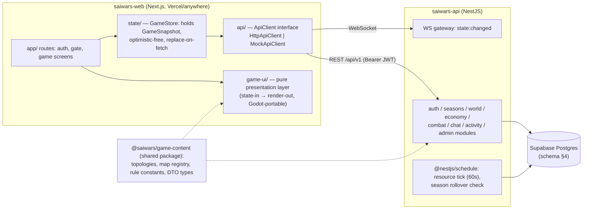

# 02 — Target Architecture: the Split

> Two new repositories/projects. Names used throughout the docs:
> - **`saiwars-web`** — Next.js frontend (presentation only, stub-backed until wired).
> - **`saiwars-api`** — NestJS backend (all game logic/state) + Supabase (Postgres) for data.
>
> The API contract between them is normative and lives in `05-API-CONTRACT.md`. Product intent is
> `docs/INTENT.md`. Keep behavior 1:1 with today's game first (port), and only then evolve it.
> Do not "improve" game rules during the split.



---

## 1. Frontend project: `saiwars-web` (Next.js)

### 1.1 Goals
- Contains **only** presentation: layout, rendering, input collection, formatting, animation.
- Every screen renders from a single immutable `GameSnapshot` object (mirror of
  `GET /game/state`), exactly like today's `G` — but with rendering **decoupled from fetching**.
- Runs fully standalone against `MockApiClient` (stubs) with zero backend.
- The `game-ui/` layer must be portable to Godot later: no Next.js/React types in its *logic*
  (view-models, formatting, map geometry); React components are thin wrappers over it.

### 1.2 Proposed structure

```
saiwars-web/
  package.json                  # next, react, typescript; NO socket.io yet (native WebSocket or socket.io-client, see §1.6)
  app/
    layout.tsx                  # global shell, theme
    page.tsx                    # boot: session check → redirect to /auth | /gate | /game
    auth/page.tsx               # login/register  (from index.html #auth-screen + submitAuth/setAuthMode)
    gate/page.tsx               # season gate     (from #season-gate + showSeasonGate/joinSeason)
    game/layout.tsx             # top bar, resource bar, bottom nav (from .top-bar/.resource-bar/.bottom-nav)
    game/city/page.tsx          # City screen     (renderCity, train UI)
    game/map/page.tsx           # Map screen      (map workspace, scoreboard, territory panel)
    game/activity/page.tsx      # Activity tabs   (feed/rankings/my-stats/seasons)
    game/chat/page.tsx          # Faction chat
    game/admin/page.tsx         # Admin panel (render only if snapshot.player.role === 'admin' && username === 'Sai')
  src/
    api/
      ApiClient.ts              # interface: one method per endpoint in 05-API-CONTRACT.md
      HttpApiClient.ts          # fetch impl (port of apiFetch: bearer token, error.status, network-vs-401 semantics)
      MockApiClient.ts          # stub impl (see §1.5)
      RealtimeClient.ts         # interface { connect(token), onStateChanged(cb), disconnect() }
      mocks/                    # fixture data mirroring the contract (snapshot.json, battles.json, …)
    state/
      GameStore.ts              # holds GameSnapshot + session; actions call ApiClient, then setSnapshot(response.state)
      session.ts                # token storage (localStorage key 'trying_game_token'), last-screen persistence
      refresh.ts                # port of scheduleRealtimeRefresh/refreshGameStateInBackground (debounce, in-flight queue, 60s poll)
    game-ui/                    # ★ PORTABLE LAYER — no React imports allowed here (enforce with eslint rule)
      types.ts                  # GameSnapshot, Territory, Player, Season DTOs (imported from @saiwars/game-content)
      selectors.ts              # canAttack(), affordableTrainingAmount(), territoryCountsByFaction(), scoreboard rows
      format.ts                 # fmt(), formatCountdown(), formatBonusLabel(), ownerLabel(), factionIcon(), getBonusIcon()
      map/
        layout.ts               # buildTerritoryLayout (topology → {cx,cy}), createHexPoints, sortTerritoryIds
        camera.ts               # pan/zoom/pinch state machine (port of mapView + initializeMobileMap, DOM events injected)
        mapScene.ts             # pure scene description: given (territories, layout, selection, playerFaction)
                                #   → list of draw ops {hex, label, troops, bonusIcon, capitalMarker, edges}
      viewmodels/
        cityVm.ts               # building cards (levels, production, next cost) from snapshot + BUILDING_DEFS
        territoryPanelVm.ts     # selected-territory panel fields + which action sections show
        activityVm.ts           # battle feed lines, rankings tables, my-stats grid
        seasonVm.ts             # gate countdown, scoreboard, season history rows
    components/                 # React wrappers (thin): <SvgMap/> renders mapScene ops, <BuildingCard/>, <Toast/>, …
  tests/                        # vitest: game-ui pure functions get direct unit tests (replaces the fake-DOM Node tests)
```

### 1.3 The state-in → render-out contract (Godot portability)

Rule set for `src/game-ui/` (this is the piece that ports to Godot):

1. **Input:** a `GameSnapshot` (+ small UI state: `selectedTerritoryId`, input counts, camera).
2. **Output:** plain data — view-models and draw-op lists. Never DOM nodes, never JSX, never fetch.
3. All formatting/derivation functions are pure and synchronous (they already are today —
   `fmt`, `formatCountdown`, `canAttack`, `buildTerritoryLayout` etc. port nearly verbatim).
4. Side effects (HTTP, storage, timers, sockets) live only in `src/api/` and `src/state/`.
5. React components subscribe to `GameStore` and call `game-ui` functions to get what to draw.
   In Godot, the same view-models feed GDScript/C# scenes; the mapScene draw-ops map to Node2D
   primitives instead of SVG elements.
6. User intents are named commands (`attack(territoryId, soldiers)`, `train(amount)`) exposed by
   `GameStore`; components never call `ApiClient` directly.

### 1.4 What ports from where (frontend function mapping)

| Current (`script.js`) | Target |
|---|---|
| `DEFAULT_STATE`, `G`, `setGameStateFromSnapshot` (11–227) | `state/GameStore.ts` (snapshot replace; chat-invalidation-on-faction-change rule preserved) |
| `apiFetch`, `getToken`/`setToken`, `ensureSession`, `fetchCurrentUser` (233–348) | `api/HttpApiClient.ts` + `state/session.ts` (keep 401-only-logout + retry semantics) |
| `loadGame`, `refreshGameStateInBackground`, boot logic (519–627, 2096–2156) | `app/page.tsx` boot + `state/refresh.ts` |
| `connectRealtime`, `scheduleRealtimeRefresh`, `disconnectRealtime` (241–277) | `api/RealtimeClient.ts` + `state/refresh.ts` |
| `submitAuth`, `setAuthMode`, `buildAuthPayload`, `logoutPlayer` (350–517) | `app/auth/page.tsx` |
| `showSeasonGate`, `joinSeason` (388–430) | `app/gate/page.tsx` + `viewmodels/seasonVm.ts` |
| `showScreen`, `restoreSavedScreen` (643–679) | Next.js routing + `state/session.ts` (persist last route per player id) |
| `renderCity`, `updateResourceBar`, `renderFactionBonuses`, `updateTrainingCostDisplay`, `changeTrain`, `trainSoldiers`, `upgradeBuilding`, `getAffordableTrainingAmount`, `calculateTrainingCost` (681–868) | `viewmodels/cityVm.ts` + `selectors.ts` + City components; cost math re-exported from `@saiwars/game-content` (single source) |
| `renderMap`, `buildTerritoryLayout`, `createHexPoints`, `sortTerritoryIds`, `canAttack`, `FACTION_FILL/STROKE`, `renderMapLegend` (870–1024, 89–110) | `game-ui/map/layout.ts` + `mapScene.ts` + `<SvgMap/>` |
| `mapView`, `initializeMobileMap`, `applyMapView`, `changeMapZoom`, `resetMapView` (35, 1026–1188) | `game-ui/map/camera.ts` (pure state machine) + pointer-event adapter component |
| `selectTerritory`, `closeTerritoryPanel`, `ownerLabel`, `formatBonusLabel`, `getBonusIcon` (1192–1279) | `viewmodels/territoryPanelVm.ts` + `format.ts` |
| `launchAttack`, `sendDefenders`, `recallDefenders`, `changeAttack/Defend/Recall`, `readTroopInput`, battle popup (1281–1443) | `GameStore` commands + Map screen components |
| Activity: `renderActivity`, `showActivityTab`, `renderRankings`, `renderMyStats`, `renderSeasonHistory`, `ACTIVITY_STAT_LABELS`, `factionIcon` (162–186, 1445–1585) | `app/game/activity/page.tsx` + `viewmodels/activityVm.ts` |
| Chat: `renderFactionChat`, `renderFactionMembers`, `sendFactionChatMessage`, `insertChatEmoji`, polling, scroll helpers (1587–1712) | `app/game/chat/page.tsx` (poll every 4 s while visible, preserve near-bottom autoscroll rule `isFactionChatNearBottom`) |
| Admin: `renderAdminPanel` + `admin*` (1714–2036) | `app/game/admin/page.tsx` (can stay React-coupled; not Godot-portable, not needed there) |
| `showToast` (49), `enablePullToRefreshFallback` (2042) | `<Toast/>` component; pull-to-refresh optional (drop or reimplement) |
| DEAD — do not port | `resolveSelectedTargetBattle`, `saveGame`, `resetGame`, `autoSave` |
| `style.css` | Port as CSS modules / global stylesheet per screen; keep `[data-faction]` theming |

### 1.5 Stub/mock strategy

- `MockApiClient implements ApiClient`. One JSON fixture per endpoint response in
  `src/api/mocks/`, shaped **exactly** per `05-API-CONTRACT.md` (fixtures generated from
  `world-topology.js` data so the map renders realistically: 33 territories, 1 capital each,
  neutral rest).
- The mock holds mutable in-memory state so flows work end-to-end offline: register/login returns a
  fake token; `train` deducts resources and increments soldiers using the shared cost function;
  `attack` applies the same `calculateBattleOutcome` rule from `@saiwars/game-content`; chat
  appends messages. This is *presentation-testing* logic only — clearly marked, never a second
  authoritative implementation.
- `MockRealtimeClient` emits `state:changed` after each mutating mock call.
- Selection via env: `NEXT_PUBLIC_API_MODE=mock|http`, `NEXT_PUBLIC_API_URL=…`. Default `mock`
  until Phase 4 of the migration plan.

### 1.6 Realtime choice

Keep the same semantic: a single `state:changed` → debounced snapshot refetch. Implementation
options (decide in Phase 3, backend first): (a) socket.io server in NestJS
(`@nestjs/platform-socket.io`) + `socket.io-client` in web — closest port; or (b) plain WebSocket
gateway. **Recommendation: (a)**, minimal change, same auth handshake shape (`auth: {token}`).
Supabase Realtime is *not* recommended for this signal: the notify-on-commit points are in service
code, and a DB-triggered channel per table would change semantics.

---

## 2. Backend project: `saiwars-api` (NestJS)

### 2.1 Module layout

```
saiwars-api/
  src/
    main.ts                       # helmet, CORS (web origin), global ValidationPipe, prefix /api/v1
    app.module.ts
    config/                       # env validation (DATABASE_URL, JWT_SECRET, ADMIN_BOOTSTRAP_TOKEN, TRUST_PROXY_HOPS)
    database/
      database.module.ts          # pg Pool provider (KEEP raw pg + SQL; see §2.3)
      database.service.ts         # query()/withClient()/withTransaction() helpers (port of db.js connect/getClient)
    auth/
      auth.module.ts / controller # POST /register, /login, GET /me
      auth.service.ts             # port of backend/auth.js (bcrypt 12, JWT 24h, same payload fields)
      jwt.strategy.ts, guards/    # JwtAuthGuard (≈requireAuth), AdminGuard (≈requireAdmin + admin-policy)
      season-context.middleware.ts# ensureCurrentSeason per request (safety net; primary = cron)
      playable-season.guard.ts    # ≈requirePlayableSeason (409 SEASON_NOT_STARTED / 403 SEASON_JOIN_REQUIRED)
    seasons/
      seasons.module.ts/service   # port of season.js verbatim (rollover, assignment, scoring, advisory locks)
      seasons.controller.ts       # POST /season/join, GET /game/season-history
      seasons.cron.ts             # @Cron: check rollover each minute (replaces request-piggyback as primary)
    world/
      world.module.ts/service     # getTerritoriesSnapshot, topology seeding (topology-sql port), map meta
      world.controller.ts         # GET /game/state (composes snapshot), GET /world/map/:key (layout for frontend, §5)
      snapshot.service.ts         # port of getPlayerWorldState + buildSeasonSummary (single DTO builder, camelCase only)
    economy/
      economy.service.ts          # game-logic.js port lives in @saiwars/game-content; service = DB orchestration
      economy.controller.ts       # POST /game/upgrade-building, /game/train-soldiers
      resource-tick.cron.ts       # @Cron(60s) runGlobalResourceTick port + offline catch-up on snapshot read
    combat/
      combat.service.ts           # performAttack port (advisory locks, casualty allocation)
      garrison.service.ts         # defender-garrisons.js port
      combat.controller.ts        # POST /game/attack, /game/defend, /game/recall-defenders
    chat/
      chat.module.ts/service/controller  # faction-chat.js port; @Throttle(10/min) on send
    activity/
      activity.service/controller # GET /game/battles, /game/activity-stats; player-season-stats.js port
    admin/
      admin.module.ts/controllers # all /admin/* routes; admin-write-operations/admin-resets/admin-faction-change ports
      audit.service.ts            # logAdminAction
    realtime/
      realtime.gateway.ts         # socket.io gateway, JWT handshake auth, emitStateChanged()
      state-change.interceptor.ts # ≈ the mutation middleware: after 2xx mutation → emitStateChanged()
  cli/
    bootstrap-admin.ts            # nest-commander: port of db.js --bootstrap-admin (token from env)
    db-init.ts                    # run migrations + seed world if empty
  supabase/
    migrations/0001_init.sql      # the consolidated schema (§4)
    migrations/0002_seed_map.sql  # optional; seeding normally done by cli/db-init from game-content
  test/                           # port the 23 node:test suites to Jest; keep the fake-pg-client pattern
```

### 2.2 Rule-for-rule porting table (backend)

| Current file | Target | Notes |
|---|---|---|
| `backend/auth.js` | `auth/auth.service.ts` | identical crypto params; keep prod-secret startup check |
| `backend/server.js` routes | controllers per module above | request/response shapes frozen by 05-API-CONTRACT.md |
| `backend/server.js` `getPlayerWorldState`/`getTerritoriesSnapshot`/`buildSeasonSummary` | `world/snapshot.service.ts` | drop snake_case aliases; only camelCase DTOs |
| `backend/server.js` `applyOfflineResourceEarnings` + `runGlobalResourceTick` | `economy/resource-tick.cron.ts` + snapshot read path | same 12 h cap, same 60 s cadence |
| `backend/game-logic.js` | `@saiwars/game-content/rules` | pure — moves to the shared package so web mocks use the same math |
| `backend/attack-logic.js` | `combat/combat.service.ts` | keep advisory lock `pg_try_advisory_xact_lock(hashtext(id))` and 409 |
| `backend/defender-garrisons.js` | `combat/garrison.service.ts` | pure allocation fns → game-content; SQL parts stay in service |
| `backend/season.js` | `seasons/seasons.service.ts` | keep both advisory-lock keys and transaction shapes |
| `backend/player-season-stats.js` | `activity/stats.service.ts` | |
| `backend/faction-chat.js` | `chat/chat.service.ts` | |
| `backend/admin-*.js` | `admin/*` | keep `runAdminTransaction` pattern + audit rows |
| `backend/realtime.js` | `realtime/realtime.gateway.ts` | same event name `state:changed` |
| `backend/trust-proxy.js` | `main.ts` (`app.set('trust proxy', …)` via express adapter) | only if still behind proxies; on managed hosting revisit |
| `backend/db.js` migrations | `supabase/migrations/0001_init.sql` (one-time consolidation) | see §4; drop the ad-hoc `ALTER TABLE IF NOT EXISTS` runner |
| `backend/topology-sql.js`, `scripts/generate-world-seed.js` | `cli/db-init.ts` seeding from game-content | `world-seed.sql` becomes obsolete |
| `backend/resolve-battle.js`, `attack_contributions`, `attack_targets` routes/tables | **not ported** | dead (01 §6.4) |
| `backend/season-time.js` | **not ported** | unused by runtime |
| `backend/territory-protection.js`, `admin-policy.js` | `@saiwars/game-content` / `admin/policy.ts` | tiny pure helpers |

### 2.3 Data-access decision

**Keep raw SQL over the `pg` Pool (via a thin DatabaseService), not an ORM.** Rationale: the ported
logic is transaction-heavy with `FOR UPDATE`, `pg_advisory_xact_lock`, CTEs, and `ON CONFLICT`
upserts; rewriting into an ORM multiplies risk with zero gameplay benefit, and the existing test
style (fake client asserting SQL) ports directly. Supabase is used as **hosted Postgres +
migrations + dashboard**; the NestJS server connects with the service-role/direct connection string
(use the session pooler or a dedicated pooler in transaction=session mode — advisory locks and
multi-statement transactions require session semantics; document `DATABASE_URL` accordingly).
Supabase Auth/RLS/Realtime are NOT used in v1 (single trusted API server; RLS can stay enabled with
service-role bypass). Recorded as an explicit decision: revisit only after the port is stable.

---

## 3. Shared package: `@saiwars/game-content`

One small versioned TypeScript package (private npm/workspace) consumed by both projects:

- `topologies/three-frontiers.ts`, `topologies/crownlands-64.ts` — direct TS ports of
  `world-topology.js` / `crownlands-topology.js` (same exported shape incl. `buildLayout`,
  `TOPOLOGY_VERSION`).
- `mapRegistry.ts` — port of `map-registry.js`.
- `rules.ts` — port of `backend/game-logic.js` **driven by** `config/balance.json` (copy the JSON
  into the package; do not re-type the numbers). Same exports:
  (`BUILDING_DEFS`, `BASE_STORAGE_CAP`, `PASSIVE_FORTRESS_TROOP_CAP`, `calculateBattleOutcome`,
  `getTrainingCost`, …) + `isCapitalTerritory`.
- `dto.ts` — the request/response types of `05-API-CONTRACT.md` (GameSnapshot etc.).
- Ports of the pure-function tests from `tests/world_topology.test.js` and the math parts of
  `tests/attack_logic.test.js` / `tests/resource_earnings.test.js`.

This resolves coupling point 01 §5.3/§5.4: backend seeds and scores from it, frontend renders and
mocks from it, and the Godot port later consumes its JSON export
(`buildTerritories()`/`buildLayout()` serialized) without a JS runtime.

## 4. Supabase schema (consolidated)

Single migration `0001_init.sql`, derived from `backend/schema.sql` ∪ `db.js` migrations, minus dead
tables. Types/defaults preserved exactly (values are game rules: 500/400/300/250/100 starts).

```sql
-- factions as a check constraint domain used everywhere
-- ('blue','red','green'); 'neutral' additionally allowed on territories.

create table players (
  id bigint generated always as identity primary key,
  username varchar(32) not null unique,
  password_hash text not null,
  faction varchar(16) null check (faction in ('blue','red','green')),
  faction_locked boolean not null default false,
  role varchar(16) not null default 'member' check (role in ('member','leader','admin')),
  army_name varchar(64) default 'Unassigned Army',
  season_wins integer not null default 0,
  resource_food integer not null default 500,
  resource_wood integer not null default 400,
  resource_iron integer not null default 300,
  resource_manpower integer not null default 250,
  soldiers integer not null default 100,
  resource_last_updated timestamptz not null default now(),
  created_at timestamptz not null default now(),
  last_login_at timestamptz,
  last_action_at timestamptz not null default now()
);

create table buildings (
  player_id bigint primary key references players(id) on delete cascade,  -- tightened: 1:1 enforced
  farm integer not null default 1,
  lumbermill integer not null default 1,
  ironmine integer not null default 1,
  barracks integer not null default 1,
  updated_at timestamptz not null default now()
);

create table territories (
  id varchar(8) primary key,
  name varchar(64) not null,
  owner_faction varchar(16) not null default 'neutral'
    check (owner_faction in ('blue','red','green','neutral')),
  defense_troops integer not null default 0 check (defense_troops >= 0),
  bonus_type varchar(32) not null default 'none',
  bonus_value numeric(6,3) not null default 0,
  is_fortress boolean not null default false,
  is_capital boolean not null default false,
  resource_bonus numeric(6,3) not null default 0,
  storage_bonus numeric(6,3) not null default 0,
  score_value integer not null default 1,
  map_x integer not null default 0,
  map_y integer not null default 0,
  created_at timestamptz not null default now(),
  last_battle_at timestamptz
);

create table territory_neighbors (
  territory_id varchar(8) not null references territories(id) on delete cascade,
  neighbor_id varchar(8) not null references territories(id) on delete cascade,
  primary key (territory_id, neighbor_id)
);

create table topology_version (
  id integer primary key default 1 check (id = 1),
  version integer not null default 0,
  map_key varchar(64) not null default 'three-frontiers',
  updated_at timestamptz not null default now()
);

create table territory_defenders (
  territory_id varchar(8) not null references territories(id) on delete cascade,
  player_id bigint not null references players(id) on delete cascade,
  faction varchar(16) not null,
  troops integer not null default 0 check (troops >= 0),
  created_at timestamptz not null default now(),
  updated_at timestamptz not null default now(),
  primary key (territory_id, player_id)
);
create index idx_defenders_territory on territory_defenders(territory_id);

create table seasons (
  id bigint generated always as identity primary key,
  season_number integer not null unique,        -- 0 = legacy bucket, kept
  starts_at timestamptz not null,
  ends_at timestamptz not null,
  status varchar(16) not null default 'active' check (status in ('active','completed')),
  map_key varchar(64) not null default 'three-frontiers',
  blue_score integer, red_score integer, green_score integer,
  result varchar(16) check (result in ('blue','red','green','draw')),
  completed_at timestamptz,
  created_at timestamptz not null default now()
);
create index idx_seasons_status on seasons(status, id desc);

create table season_memberships (
  season_id bigint not null references seasons(id) on delete cascade,
  player_id bigint not null references players(id) on delete cascade,
  faction varchar(16) not null check (faction in ('blue','red','green')),
  assigned_at timestamptz not null default now(),
  primary key (season_id, player_id)
);
create index idx_season_memberships_season_faction on season_memberships(season_id, faction);

create table battle_history (
  id bigint generated always as identity primary key,
  attacker_faction varchar(16) not null,
  defender_faction varchar(16) not null,
  territory_id varchar(8) not null references territories(id) on delete cascade,
  attacker_player_id bigint references players(id) on delete set null,
  troops_sent integer not null default 0,
  defender_total integer not null default 0,
  applied_bonuses jsonb,                         -- was TEXT holding JSON; upgraded to jsonb
  winner varchar(16) not null,
  attackers_lost integer not null default 0,
  attackers_surviving integer not null default 0,
  defenders_lost integer not null default 0,
  defenders_surviving integer not null default 0,
  owner_before varchar(16) not null,
  owner_after varchar(16) not null,
  created_at timestamptz not null default now()
);
create index idx_battle_history_recent on battle_history(id desc);

create table player_season_stats (
  season_id bigint not null references seasons(id) on delete cascade,
  player_id bigint not null references players(id) on delete cascade,
  kills integer not null default 0,
  losses integer not null default 0,
  battles_joined integer not null default 0,
  battles_won integer not null default 0,
  successful_defences integer not null default 0,
  territories_captured integer not null default 0,
  retakes integer not null default 0,
  reinforcement_troops_sent integer not null default 0,
  updated_at timestamptz not null default now(),
  primary key (season_id, player_id)
);

create table season_territory_faction_ownership (
  season_id bigint not null references seasons(id) on delete cascade,
  territory_id varchar(8) not null references territories(id) on delete cascade,
  faction varchar(16) not null,
  primary key (season_id, territory_id, faction)
);

create table faction_chat_messages (
  id bigint generated always as identity primary key,
  season_id bigint not null references seasons(id),   -- tightened: NOT NULL (legacy bucket covers old rows)
  faction varchar(16) not null,
  player_id bigint not null references players(id) on delete cascade,
  message text not null check (char_length(message) <= 500),
  created_at timestamptz not null default now()
);
create index idx_chat_season_faction_time on faction_chat_messages(season_id, faction, created_at desc, id desc);

create table admin_actions (
  id bigint generated always as identity primary key,
  actor_id bigint references players(id) on delete set null,
  action_name varchar(64) not null,
  action_detail jsonb,
  created_at timestamptz not null default now()
);

create table faction_leaders (                    -- ported as-is (cheap); candidate for removal later
  faction varchar(16) primary key,
  player_id bigint null references players(id) on delete set null
);

-- RLS: enable on all tables with NO policies (deny-all for anon); the NestJS server uses the
-- service role / direct connection and bypasses RLS. Prevents accidental exposure via PostgREST.
```

**Dropped vs. current DB:** `attack_contributions`, `attack_targets` (dead, 01 §6.4).
**Changed:** `buildings.player_id` becomes PK (1:1), `applied_bonuses`/`action_detail` → `jsonb`,
chat `season_id` NOT NULL, check constraints added. Everything else is byte-compatible so data can
be copied with plain `INSERT INTO … SELECT` if the live world is migrated (see 03 Phase 5).

## 5. Map/topology data flow after the split

- Source of truth: `@saiwars/game-content` topologies (versioned).
- Backend seeds `territories` + `territory_neighbors` + `topology_version` from it (db-init CLI /
  season reseed), exactly like `topology-sql.js` today.
- Frontend gets layout **two ways, pick one and stick to it**:
  - **Recommended:** import from `@saiwars/game-content` (same package, zero latency, works in
    mocks) — mirrors today's `<script src="world-topology.js">` reliance.
  - Alternative (Godot-friendlier later): `GET /world/map/:mapKey` returns
    `{viewBox, layout: {[id]:{cx,cy}}}` — the DB already has `map_x`/`map_y`. Add this endpoint
    regardless (cheap) so Godot never needs the JS/TS package.

## 6. API contract between the projects

Normative version in `05-API-CONTRACT.md`. Summary of deltas vs. today:

- Prefix `/api/v1` (was `/api`). Same JWT bearer auth, same error envelope `{error, code?}`.
- Dropped: `POST /game/resolve-battle`, `GET /world`, `GET /player/state`,
  `POST /player/faction` (dead/tombstones).
- Territory DTO: camelCase only (`owner`, `defense`, `bonusType`, `bonusValue`, `storageBonus`,
  `scoreValue`, `fortress`, `capital`, `neighbors`).
- Added: `GET /world/map/:mapKey` (layout), `GET /health` kept.
- Everything else 1:1 with the inventory in `01-CURRENT-STATE-ANALYSIS.md` §3.
