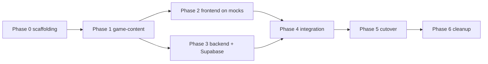

# 03 — Migration Plan (phased)

> Ordered so that every phase ends in a verifiable, working state and no phase requires the other
> project to already be finished. The current repo stays untouched and deployable throughout;
> the two new projects are built alongside it. Task-level breakdown lives in `04-TODO.md`.

## Guiding decisions (locked)

1. **Port, don't redesign.** Game rules, endpoint semantics, and DB shapes are frozen at parity
   with the current code until both projects pass the ported test suites (see 02 preamble).
2. **Contract-first.** `05-API-CONTRACT.md` is written (done) before any code; frontend mocks and
   backend controllers both implement it independently.
3. **Shared package first.** `@saiwars/game-content` unblocks both sides and eliminates the
   rule-duplication drift documented in `01 §1.2/§5.4`.
4. **Frontend and backend tracks are parallel** after Phase 1 — different agents can work them
   concurrently.

---

## Phase 0 — Repo scaffolding & contract freeze

**Work:** create `saiwars-web` (Next.js + TS), `saiwars-api` (NestJS + TS), and the
`@saiwars/game-content` package (workspace/monorepo or three repos — recommend a single monorepo
with npm workspaces: `packages/game-content`, `apps/web`, `apps/api`). Copy these `docs/` into it.
Set up lint/format/CI skeletons.

**Rationale:** everything downstream imports game-content; CI from day one keeps the AI-agent
workflow honest.

**Risks:** none material.
**Verify:** `npm run build` and empty test suites pass in CI for all three workspaces.

## Phase 1 — `@saiwars/game-content`

**Work:** port `world-topology.js`, `crownlands-topology.js`, `map-registry.js`,
`backend/game-logic.js` (pure parts of `defender-garrisons.js`: `allocateDefenderCasualties`,
`getTerritoryDefenseState`, `resolveDefenderCasualties`), `territory-protection.js`, and the DTO
types from `05-API-CONTRACT.md`. Port the relevant tests (`world_topology.test.js`, math sections
of `attack_logic.test.js`, `resource_earnings.test.js`).

**Rationale:** these are dependency-free pure modules — lowest-risk, highest-leverage first step.

**Risks:** subtle numeric drift (e.g. `Math.round` vs `Math.floor` in training cost — copy code,
don't re-derive). Mitigation: golden-value tests copied from the old suite.
**Verify:** ported tests green; a scripted comparison harness runs old JS module and new TS module
over the same inputs (territory list, layouts, battle outcomes for a grid of attacker/defender
counts) and asserts identical output.

## Phase 2 — Frontend on mocks (`saiwars-web`)

**Work:** build the entire Next.js app against `MockApiClient` per `02 §1`: auth screen, season
gate, city, map (SVG render + camera), activity, chat, admin. Implement `GameStore`,
`HttpApiClient` (unused yet), fixtures.

**Rationale:** the frontend is fully testable without any backend; visual parity can be checked
against the running legacy game side by side.

**Risks:**
- *Behavior parity gaps* (the old client has subtle rules: 401-only logout, chat invalidation on
  faction change, near-bottom autoscroll, click-suppression after drag). Mitigation: these are
  enumerated in `02 §1.4`; treat that table as the checklist.
- *Godot-portability erosion* (React creep into `game-ui/`). Mitigation: eslint boundary rule +
  review gate in TODO.

**Verify:** app runs with `NEXT_PUBLIC_API_MODE=mock`; manual walkthrough of every screen/flow;
unit tests for `game-ui` pure functions; screenshot comparison vs. legacy UI (best-effort).

## Phase 3 — Backend port (`saiwars-api` + Supabase)

**Work:**
1. Create Supabase project; apply `0001_init.sql` (02 §4). Configure `DATABASE_URL`
   (session-mode connection — advisory locks + transactions required, see 02 §2.3).
2. Port modules in dependency order: database → auth → seasons → world/snapshot → economy (+tick
   cron) → combat/garrisons → chat → activity/stats → admin → realtime gateway → CLI
   (db-init, bootstrap-admin).
3. Port the backend test suites (fake-pg-client pattern carries over to Jest almost mechanically).
4. Add the rollover cron + keep per-request `ensureCurrentSeason` as safety net (01 §5.7).

**Rationale:** dependency order matches how server.js composes; each module lands with its tests.

**Risks:**
- *Transaction/locking regressions* — the trickiest code (`performAttack`, `runSeasonRollover`,
  `ensurePlayerFactionAssignment`) relies on advisory locks + `FOR UPDATE`. Mitigation: copy SQL
  verbatim; run the ported concurrency tests; add one integration test against a real (local or
  Supabase branch) Postgres for attack racing.
- *Supabase pooler pitfalls* — transaction-mode pooling (port 6543) silently breaks session
  advisory locks. Mitigation: mandate the session/direct connection string in config validation;
  document in README.
- *Schema consolidation errors* — migration superset mistakes. Mitigation: diff-check script
  comparing `information_schema` of a legacy DB (after `db:init`) vs. new Supabase schema, column
  by column (excluding intentionally dropped/changed items listed in 02 §4).

**Verify:** all ported Jest suites green; `GET /api/v1/game/state` output validates against the
contract types; a smoke script exercises register → join → train → attack → chat → admin
force-finish against a scratch Supabase branch.

## Phase 4 — Integration

**Work:** point `saiwars-web` at the real API (`NEXT_PUBLIC_API_MODE=http`), enable CORS on the API
for the web origin, wire the socket.io client, and fix contract mismatches (they will exist; the
contract doc arbitrates). Add an e2e happy-path test (Playwright): register, join season, train,
attack a neutral territory, see the battle in the feed, send a chat message.

**Rationale:** first end-to-end assembly; both sides claim contract compliance — this phase proves it.

**Risks:** CORS/auth-header details (the legacy app was same-origin, 01 §5.10); socket handshake
differences; timing (season gate depends on `startsAt` vs client clock — snapshot includes
`serverTime`, use it). 
**Verify:** e2e suite green against a staging deployment (web on Vercel preview or local, API on a
staging host, Supabase branch DB).

## Phase 5 — Cutover & data migration

**Work:**
1. Decide: fresh world (recommended — the game is seasonal by design; a season boundary is a
   natural cutover point) vs. data copy. If copying: dump legacy Postgres, transform-load into
   Supabase (tables are near-identical; `applied_bonuses` text→jsonb cast; skip dead tables),
   verify row counts + spot checks.
2. Register/bootstrap the `Sai` admin (CLI with `ADMIN_BOOTSTRAP_TOKEN`).
3. Deploy: web → Vercel (or static host), API → host of choice (VPS/systemd like today, or a
   container platform). New GitHub Actions per project (build + test + deploy), replacing
   `deploy.yml`'s sed/`systemctl` flow for the web app entirely.
4. DNS/Cloudflare: route the game domain to the web app; API on subdomain (`api.…`). Set
   `TRUST_PROXY_HOPS` per the new topology (old assumption was 2, 01 backend/trust-proxy.js).
5. Freeze the legacy repo (archive branch, README pointer to the new projects).

**Risks:** player disruption if cutover mid-season (mitigate: cut at season rollover, announce in
chat/info modal); JWT secret rotation logs everyone out (acceptable: 24 h tokens anyway).
**Verify:** production health checks; a full season lifecycle observed on staging beforehand
(force-finish → preseason gate → join → play), plus resource ticks over ≥10 minutes matching
production rates.

## Phase 6 — Post-split cleanup & Godot-prep (optional, after stability)

**Work:** remove tombstoned endpoints, decide `faction_leaders` fate, export game-content as JSON
for Godot (`buildTerritories()`/`buildLayout()` snapshots), evaluate scoped realtime events
(replace global `state:changed` broadcast, 01 §6.7), consider Supabase Realtime/RLS if the API ever
becomes non-exclusive.

**Verify:** contract version bump + regenerated mocks; e2e still green.

---

## Phase dependency graph

## Global risk register

| Risk | Phase | Mitigation |
|---|---|---|
| Rule drift between old/new implementations | 1–3 | golden-value comparison harness; copy code verbatim; freeze contract |
| Advisory locks broken by connection pooling mode | 3, 5 | session-mode `DATABASE_URL` enforced in config validation |
| Hidden schema pieces missed (migrations ≠ schema.sql) | 3 | information_schema diff script vs. legacy `db:init` DB |
| React leaking into the portable layer | 2, 6 | eslint import boundary + TODO review task |
| CORS/auth regressions from losing same-origin | 4 | e2e suite; explicit CORS config task |
| Cutover data loss / player disruption | 5 | cut at season boundary; backup dump; fresh-world default |
| Broadcast refetch amplification at scale | post | keep; monitor; scoped events in Phase 6 |
